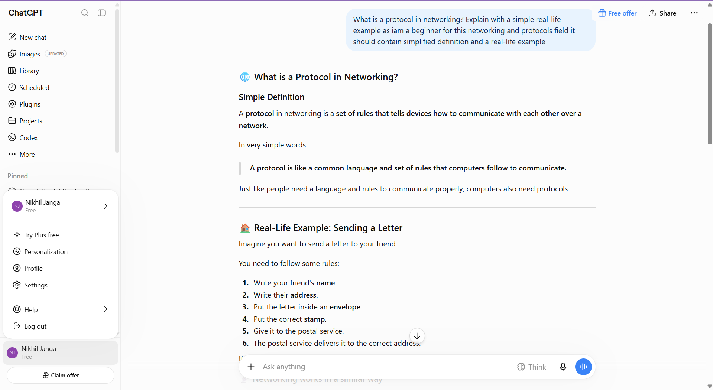
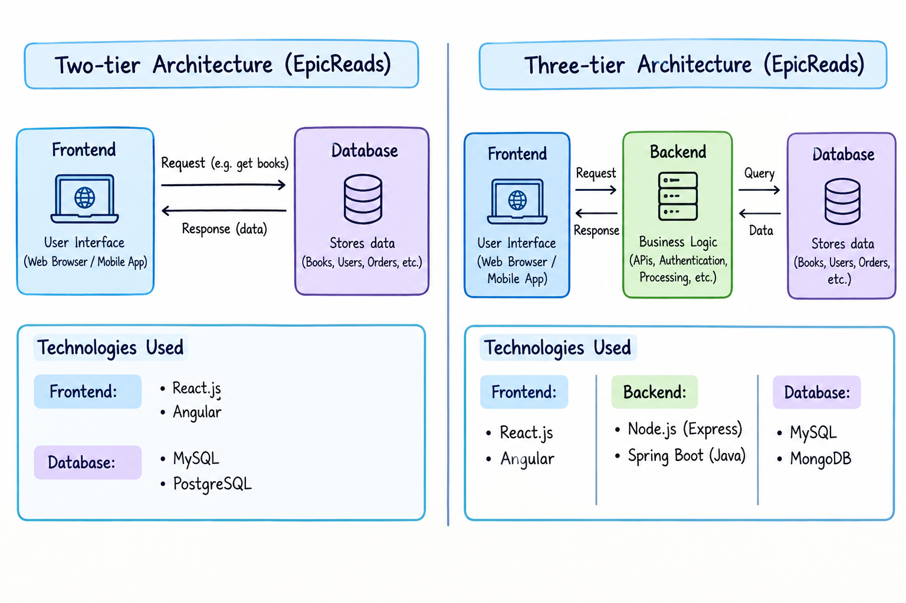
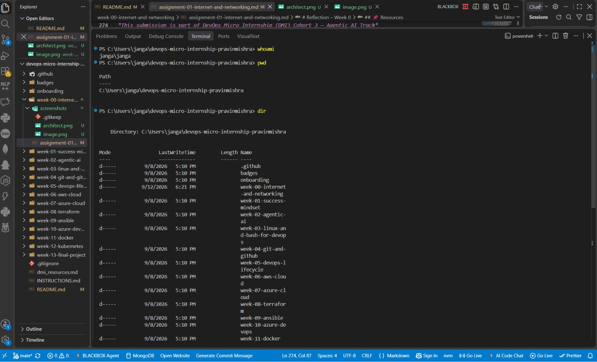

# Week 00 - Internet and Networking

Part of the DevOps Micro Internship (DMI) Cohort 3 with Agentic AI

---

# 🧑‍💻 Task 1: Using ChatGPT as Your Learning Assistant

## Scenario

You're new to DevOps and will frequently encounter technical questions. ChatGPT can be your learning companion.

## Your Task

Write a clear ChatGPT prompt to help you understand:

> "What is a protocol in networking? Explain with a simple real-life example."

Take a screenshot of your interaction showing:

* Your detailed prompt (with clear expectations)
* ChatGPT's simplified response with an example

## Screenshot

Save your screenshot in the `screenshots` folder and update the file name below.



Replace `image.png` with your actual screenshot file name.
---
## What I Learned (2–3 lines)
protocol is nothing but set of rules and regulations to communicate properly between the devices which are prrsent in the network.if we not follow this rules it would be diffuclt to manage efficent network.we have different types of protocols HTTP-which is used in transferring webpages,HTTPS-It is used for secure transfer by encryption and decryption
TCP-Ensures data is delivered reliably or not,DNS-Converts website names into IP addresses

---

# 🌐 Task 2: Internet and Networking

## Scenario

Your friend is launching an online bookstore named **EpicReads**.

He asked you to explain how users globally can access his website hosted in Finland.

## Your Task

Write a short explanation (**100–150 words**) that includes:

* Packet Switching
* IP Address
* TCP/IP
* HTTP/HTTPS

💡 **Tip:** You may use ChatGPT (as demonstrated in Task 1) to refine your explanation.

## Answer

When a user in the USA opens the EpicReads website, their computer first uses the website’s IP address to identify the server hosting EpicReads in Finland. The data is divided into small pieces called packets. These packets travel through different networks and routers across the Internet and may take different routes before reaching Finland. This process is called packet switching.
TCP/IP is the main set of communication protocols used on the Internet. IP handles addressing and routing the packets, while TCP helps ensure that the packets are delivered correctly and in the proper order. Once the request reaches the EpicReads server, HTTP or HTTPS is used to communicate between the user's browser and the web server. HTTPS provides encryption, making communication more secure. The server then sends the requested webpage back to the user's computer using the same Internet communication process.
---

# 🏗️ Task 3: Application Architecture & Stack

## Scenario

EpicReads bookstore has two application versions:

### Two-Tier Application

* Frontend
* Database

### Three-Tier Application

* Frontend
* Backend
* Database

## Your Task

* Draw simple diagrams (hand-drawn or tool-based such as draw.io)
* Label each layer clearly
* List at least two common technologies or tools used for each layer
* Submit a screenshot or photo clearly showing your own drawing\

## Diagram Screenshot / Photo

Save your diagram image in the `screenshots` folder and update the file name below.

Replace `architect.png` with your actual diagram file name.

---

## Technologies Used

### Frontend
React.js, Angular

### Backend

Node.js/Express, Spring Boot

### Database
MySQL, PostgreSQL

---

# 🌍 Task 4: Domain Name & DNS (Basic Concepts)

## Scenario

Your friend's bookstore **EpicReads** is currently accessible through:

```text
52.172.142.222:3000
```

He purchased the domain:

```text
epicreads.com
```

## Your Task

In **50–100 words**, explain in your own words:

1. What is DNS (Domain Name System)?
2. Which DNS record type should be used to connect the domain to the given IP, and why?

## Answer
DNS (Domain Name System) is like the Internet’s phonebook. It converts human-readable domain names, such as epicreads.com, into IP addresses that computers use to find the correct server. To connect epicreads.com to the IPv4 address 52.172.142.222, an A record should be used because an A record maps a domain name to an IPv4 address. The port 3000 is not included in the DNS record; it is handled separately by the application or a web server/reverse proxy.


---

# 💻 Task 5: Visual Studio Code Setup (Hands-on)

## Your Task

Install Visual Studio Code (if not already installed).

Take a screenshot of your VS Code environment showing:

* Terminal open inside VS Code
* Running a basic command:

### Windows

```powershell
dir
```

### Linux / macOS

```bash
pwd
ls
```

* Your selected VS Code theme clearly visible

⚠️ **Important:** The screenshot must show your username or another identifiable detail to confirm it is your environment.

## Screenshot

Save your screenshot in the `screenshots` folder and update the file name below.




Replace `vscode.png` with your actual screenshot file name.

---

# 🔗 Task 6: Publish Your Assignment as a LinkedIn Post

## Objective

Publishing on LinkedIn helps you:

* Build your professional online presence
* Reinforce your learning
* Document your DevOps journey publicly

## Your Task

Summarize your answers from Tasks 1–5 into a LinkedIn post.

Clearly structure your post into the following sections:

* ChatGPT
* Internet & Networking
* App Architecture
* DNS
* VS Code Setup

Use the credit note that matches your track:

Add the following credit note at the end of your post **(If you are DMI Cohort 3 student)**:

> **P.S. This post is part of the DevOps Micro Internship (DMI) with Agentic AI — Cohort 3 — by Pravin Mishra. My graded progress is public: https://dmi.pravinmishra.com/s/YOUR-GITHUB-USERNAME.html · Start your DevOps journey: https://dmi.pravinmishra.com/?utm_source=student&utm_medium=ps-linkedin&utm_campaign=cohort3**


Add the following credit note at the end of your post **(If you are DMI Self-paced track student)**:

> **P.S. This post is part of the DevOps Micro Internship (DMI) — Self-Paced Engineer Track — by Pravin Mishra. My graded progress is public: https://dmi.pravinmishra.com/s/YOUR-GITHUB-USERNAME.html · Start your DevOps journey: https://dmi.pravinmishra.com/?utm_source=student&utm_medium=ps-linkedin&utm_campaign=self-paced**

Add the following credit note at the end of your post **(If you are DMI Campus student)**:

> **P.S. This post is part of the DevOps Micro Internship (DMI) — Campus — by Pravin Mishra. My graded progress is public: https://dmi.pravinmishra.com/s/YOUR-GITHUB-USERNAME.html · Start your DevOps journey: https://dmi.pravinmishra.com/?utm_source=student&utm_medium=ps-linkedin&utm_campaign=campus**

Replace `YOUR-GITHUB-USERNAME` with your GitHub username — that link is your public DMI progress page (your graded badge page).
---

## LinkedIn Post URL

Paste your LinkedIn post URL here:

```text
https://www.linkedin.com/in/nikhil-janga-7a056428b/
```

---

## LinkedIn Post Backup Copy

Paste the full text of your LinkedIn post here:

🚀 Week 0 of my DevOps journey is complete!

I’m excited to share my learning and hands-on progress as part of the DevOps Micro Internship (DMI) — Cohort 3 by Pravin Mishra.

This week helped me build a strong foundation in DevOps concepts and understand how different technologies work together.

🔹 ChatGPT
I explored how AI tools such as ChatGPT can support learning, problem-solving, technical research, and understanding complex concepts through simple explanations and practical examples.

🔹 Internet & Networking
I learned the fundamentals of computer networking, including how devices communicate over a network, what protocols are, and how different networking concepts support communication between systems.

🔹 App Architecture
I learned about application architecture and how different components of an application interact with each other. I explored concepts such as frontend, backend, databases, APIs, and the three-tier architecture.

🔹 DNS
I learned how the Domain Name System (DNS) works and how domain names are translated into IP addresses. I also understood the role DNS plays when users access websites and applications.

🔹 VS Code Setup
I configured Visual Studio Code as my development environment, selected a suitable theme, opened the integrated terminal, and practiced using basic terminal commands.

💡 Key Takeaway:
This week helped me understand that DevOps is not only about tools. It is about understanding how applications, infrastructure, networking, development, and operations work together.

I’m looking forward to building more hands-on skills in the upcoming weeks and continuing my journey toward becoming a Cloud/DevOps Engineer. ☁️🚀

#DevOps #DevOpsJourney #CloudComputing #Networking #DNS #VSCode #CloudEngineer #Learning #DMI #AgenticAI
P.S. This post is part of the DevOps Micro Internship (DMI) with Agentic AI — Cohort 3 — by Pravin Mishra. My graded progress is public: https://dmi.pravinmishra.com/s/nikhil-janga.html · Start your DevOps journey: https://dmi.pravinmishra.com/?utm_source=student&utm_medium=ps-linkedin&utm_campaign=cohort3

---

# Reflection – Week 0

### What did you find easy?

I found it easy to understand the basic concepts of networking, DNS, application architecture, and using Visual Studio Code. The practical activities helped me connect theoretical concepts with real-world examples.
---

### What was difficult?

 Understanding how different components of networking, DNS, application architecture, and DevOps work together was initially challenging. Some technical concepts required additional research and practical exploration to understand clearly.

---

### What will you improve next week?
Next week, I want to improve my hands-on skills by practicing more with DevOps tools and commands. I also want to strengthen my understanding of cloud computing, Linux, Git, and automation and apply these concepts through practical tasks.

---

## 📌 About DMI & CloudAdvisory

DevOps Micro Internship (DMI) is a project-based DevOps program run by Pravin Mishra (The CloudAdvisory) focused on real-world execution, systems thinking, and career readiness.

It helps learners build strong DevOps foundations with hands-on experience.


## 📌 Resources

- 🌐 **DMI Official Website:** https://dmi.pravinmishra.com?utm_source=github&utm_medium=readme  
- 🎓 **University:** https://university.pravinmishra.com?utm_source=github&utm_medium=readme  
- 💬 **Discord Community:** https://discord.pravinmishra.com?utm_source=github&utm_medium=readme  
- 📝 **Blog:** https://dmi.pravinmishra.com/blog?utm_source=github&utm_medium=readme  
- ▶️ **YouTube Playlist (DMI Cohort 3):** https://www.youtube.com/playlist?list=PLFeSNDtI4Cho  
- 🔗 **Pravin Mishra (LinkedIn):** https://www.linkedin.com/in/pravin-mishra-aws-trainer/  
- 🏢 **CloudAdvisory (LinkedIn):** https://www.linkedin.com/company/thecloudadvisory/

---

*This submission is part of DevOps Micro Internship (DMI) Cohort 3 — Agentic AI Track*